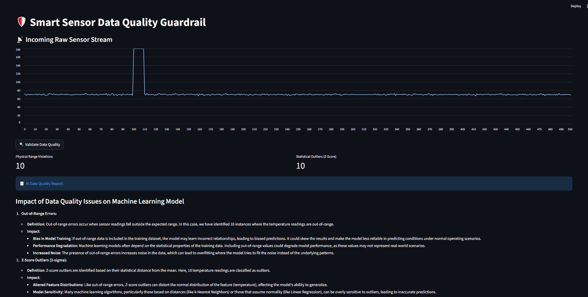
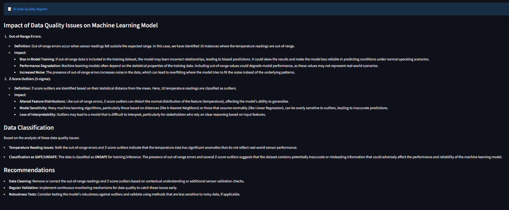

# 🛡️ Akıllı Sensör Veri Kalitesi Kalkanı (Smart Sensor Data Quality Guardrail)

Akıllı üretim hatlarında, endüstriyel sensör verilerini yapay zeka modeline ulaşmadan önce doğrulayarak yapay zeka güvenilirliğini sağlayan sistem. Bu proje, modern Endüstri 4.0 boru hatlarındaki **"Veri Doğrulama" (Data Validation)** gereksinimlerini karşılar.

## 🚀 Proje Özeti
Endüstriyel ortamlarda sensör arızaları (donmuş sensörler, ani sıçramalar veya veri kayması) felaket niteliğinde yanlış AI tahminlerine yol açabilir. Bu "Koruma Kalkanı" (Guardrail) sistemi, ham veriyi filtreleyen ve yapay zeka destekli kalite içgörüleri sağlayan istatistiksel bir güvenlik katmanı görevi görür.

---

## 📊 Sistem Çıktıları ve Analiz

Sistem, gelen veri akışındaki anormallikleri anında yakalar ve mühendisler için detaylı bir rapor oluşturur.

### 1. İstatistiksel Hata Tespiti (Z-Skoru ve Aralık Kontrolü)
*Aşağıdaki grafikte, sisteme bilerek enjekte edilen 180°C'lik ani sıcaklık artışının (spike) hem fiziksel aralık dışı (Physical Range Violation) hem de istatistiksel bir aykırı değer (Z-Score Outlier) olarak nasıl yakalandığı görülmektedir.*

### 2. Yapay Zeka Destekli Veri Kalite Raporu
*GPT-4o-mini, tespit edilen bu istatistiksel hataların makine öğrenmesi modeli üzerindeki potansiyel etkilerini (Bias, Overfitting riski) analiz eder ve veriyi "GÜVENSİZ" (UNSAFE) olarak sınıflandırır.*

---

## 🧠 İstatistiksel Mantık (DSM 5001 Temelli)
Sistem iki ana doğrulama katmanı kullanır:
1. **Fiziksel Aralık Kontrolleri:** Okumaların ekipmanın fiziksel çalışma limitleri içinde olup olmadığını doğrular (Örn: 0-150°C arası).
2. **İstatistiksel Aykırı Değer Tespiti:** Normal dağılımın 3-sigma kuralının dışına düşen teknik anormallikleri belirlemek için **Z-Skoru** yöntemini kullanır.

**Formül:**
$$Z = \frac{x - \mu}{\sigma}$$

*Burada $x$ okunan sensör değeri, $\mu$ (mu) ortalama ve $\sigma$ (sigma) standart sapmadır.*

## 🛠️ Teknoloji Yığını
- **Dil:** Python (OOP Prensipleri)
- **İstatistik/Veri:** NumPy, Pandas, Scikit-learn
- **Arayüz:** Streamlit
- **LLM Entegrasyonu:** OpenAI API (GPT-4o-mini)

## 📂 Proje Yapısı
- `src/validator.py`: Temel istatistiksel mantık (Z-Skoru ve Aralıklar).
- `src/generator.py`: "Kirli" endüstriyel veri simülatörü.
- `src/describer.py`: Yapay zeka destekli veri kalitesi raporlama.
- `app.py`: Streamlit tabanlı izleme paneli.